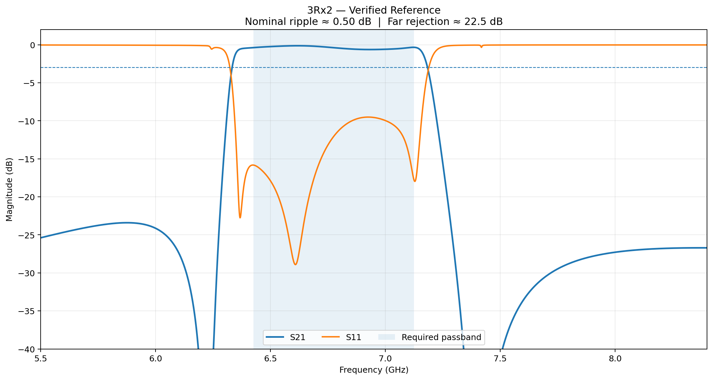
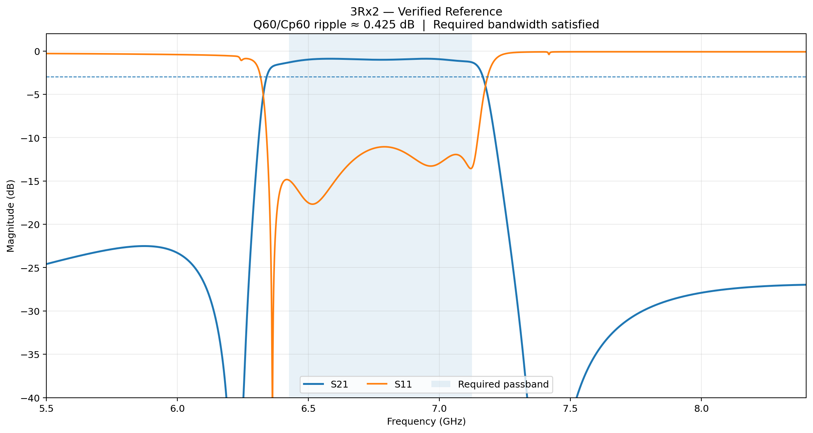
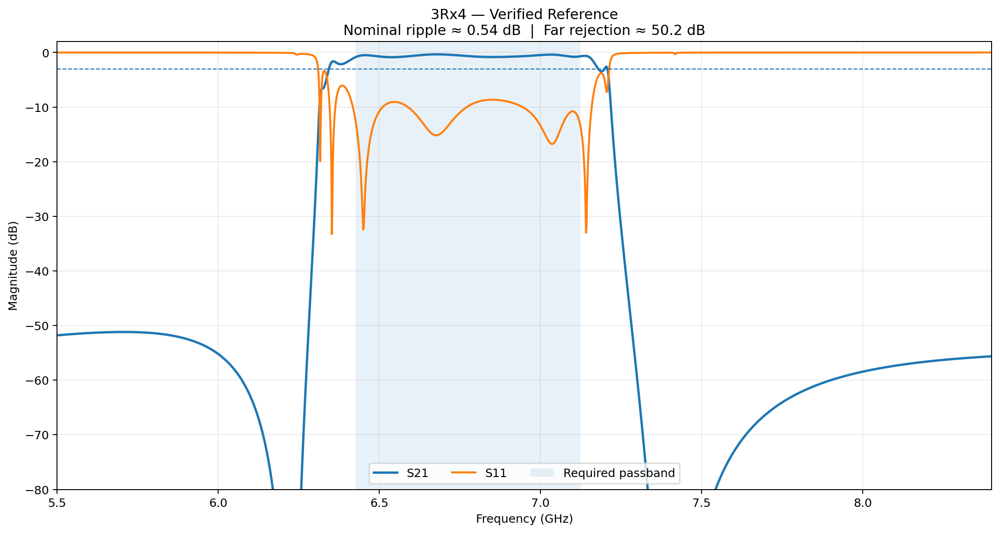
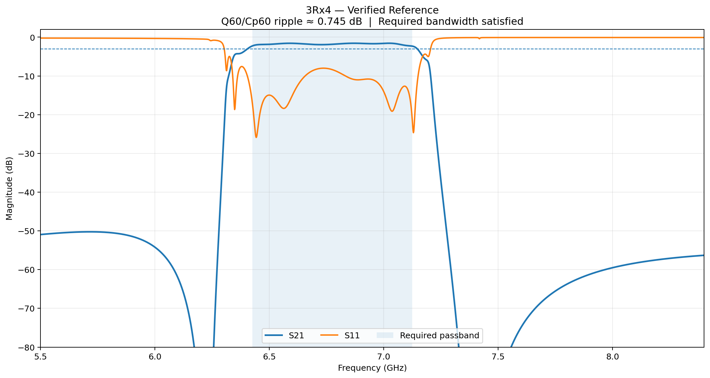
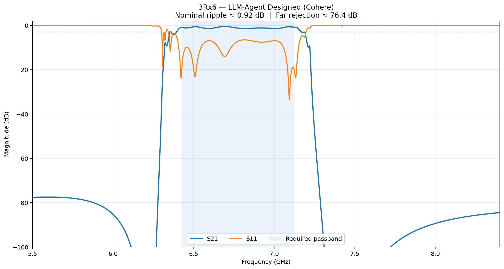
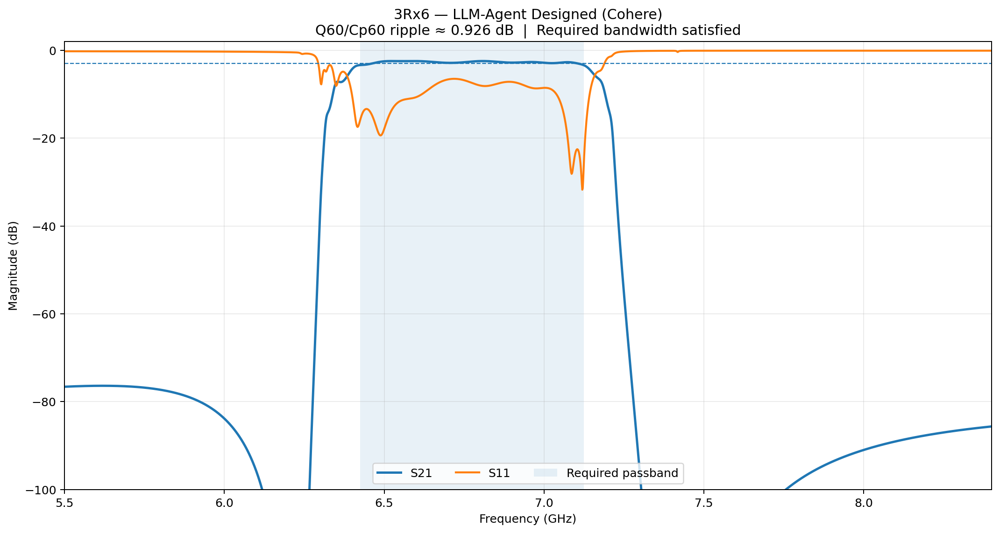
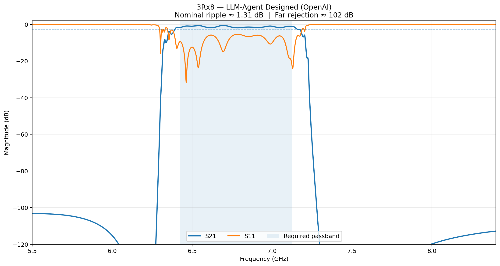
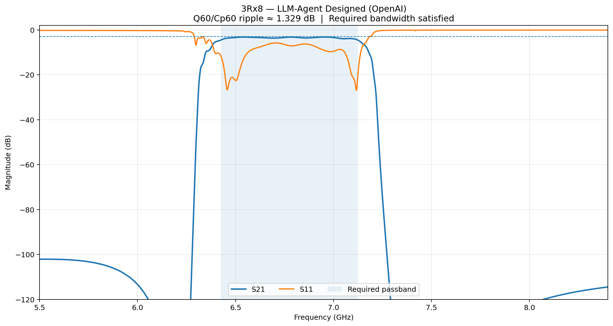

# Blind Structural Synthesis of Lower-FR3 3Rx6 and 3Rx8 FBAW Filters

## A Cross-LLM Study of Result-Dependent Autonomous RF Engineering

This case study asks a practical question:

> **Can an AI Engineering Agent autonomously evolve an RF filter family by reasoning over real engineering results—without being given the higher-order solution?**

We tested **OpenAI, DeepSeek, and Cohere** as independent LLM planning engines within the same Domain-Specific Engineering Agent architecture:

> **Engineering Goal → LLM Planning → Engineering Action → Python RF Verification → Accept / Reject / Rollback → Re-plan → Python-authorized STOP**

The LLM decides **what engineering action to try next**. The deterministic Python RF core decides **whether that action actually worked**.

The study follows the Lower-FR3 FBAW family:

**3Rx2 → 3Rx4 → blind 3Rx6 → blind 3Rx8**

The target passband is **6.425–7.125 GHz**. Bandwidth is treated as a required engineering constraint throughout.

---

## 1. Blind Structural-Synthesis Protocol

### Experiment I — 3Rx4 → 3Rx6

The Agents receive verified **3Rx2 + 3Rx4** designs. Historical 3Rx5/3Rx6+ solutions are hidden. Starting from 3Rx4, each Agent must insert exactly two legal internal cells, initialize them from known lower-order structure, observe the real RF result, and continue with result-dependent engineering actions.

### Experiment II — 3Rx6 → 3Rx8

The Agents then receive the verified **3Rx2 → 3Rx4 → newly discovered 3Rx6** evolution. Historical 3Rx7/3Rx8+ solutions remain hidden. Starting from the selected 3Rx6 parent, each Agent must insert two more cells and develop a valid 3Rx8 design.

The raw post-insertion seed is evaluated before deterministic optimization. This lets us distinguish:

- **Structural Seed Quality** — how good the topology is immediately after insertion.
- **Optimizable Potential** — how good a basin the structure provides after closed-loop engineering and deterministic optimization.

---

## 2. Engineering-Agent Architecture

### LLM planning layer

The planner can reason about insertion location, cell initialization, parameter direction, local versus global exploration, re-optimization, rollback, and whether a failed action suggests a different hypothesis.

### Deterministic RF layer

Python owns RF simulation, nominal and robustness evaluation, constrained optimization, bandwidth verification, far-rejection evaluation, candidate ranking, checkpoints, rollback, and final STOP authority.

> **LLM reasons about what to try next. Python determines whether it actually worked.**

---

## 3. RF Response Evolution

The figures below are generated from the completed deterministic RF benchmark results. The nominal and Q60/Cp60 responses are shown separately. Different vertical scales are used intentionally so the response detail remains visible as filter order and rejection increase.

### 3Rx2 — Verified Reference

**Nominal ripple ≈ 0.50 dB | Q60/Cp60 ripple ≈ 0.425 dB | Far rejection ≈ 22.5 dB**

### 3Rx4 — Verified Reference

**Nominal ripple ≈ 0.54 dB | Q60/Cp60 ripple ≈ 0.745 dB | Far rejection ≈ 50.2 dB**

### 3Rx6 — Blind LLM-Agent Design

The selected Cohere trajectory reached approximately:

**Nominal ≈ 0.924 dB | Q60/Cp60 ≈ 0.926 dB | Far rejection ≈ 76.4 dB**

### 3Rx8 — Blind LLM-Agent Design

The selected OpenAI trajectory reached approximately:

**Nominal ≈ 1.31 dB | Q60/Cp60 ≈ 1.33 dB | Far rejection ≈ 102 dB**

---

## 4. Blind 3Rx6 — Cross-LLM Results

| Planner | Nominal Ripple | Q80/Cp40 | Q60/Cp60 | Far Rejection | Bandwidth |
|---|---:|---:|---:|---:|---|
| OpenAI | ~0.960 dB | ~0.754 dB | ~0.965 dB | ~76.23 dB | Requirement met |
| DeepSeek | ~0.961 dB | ~0.724 dB | ~0.959 dB | ~76.29 dB | Requirement met |
| Cohere | **~0.924 dB** | ~0.749 dB | **~0.926 dB** | **~76.40 dB** | Requirement met |

In this specific blind 3Rx6 experiment, the Cohere trajectory reached the lowest final robust worst-case ripple. The result was discovered without providing the historical 3Rx6 solution and exceeded the previous historical 3Rx6 result available to the development flow.

### DeepSeek: result-dependent engineering behavior

DeepSeek's behavior was also particularly interesting. After selecting its insertion topology, it explored coupling-related and capacitance-related directions. When an L5-related perturbation did not improve the verified RF objective, it did not blindly continue in the same direction. It changed strategy based on the observed RF response.

That behavior can be summarized as:

> **propose → observe RF result → recognize an unproductive direction → change strategy**

This is an important part of the experiment: the planner is not merely generating a fixed sequence of parameter changes.

---

## 5. Blind 3Rx8 — Cross-LLM Results

| Planner | Initial Insertion | Raw Seed Worst Ripple | Final Robust Worst Ripple | Far Rejection | Bandwidth |
|---|---|---:|---:|---:|---|
| OpenAI | P1 + P5 | ~2.49 dB | **~1.33 dB** | ~102.1 dB | Requirement met |
| DeepSeek | P2 + P4 | ~2.13 dB | ~1.36 dB | ~102.0 dB | Requirement met |
| Cohere | P2 + P4 | ~2.13 dB | ~1.36 dB | ~102.2 dB | Requirement met |

All three Agents successfully synthesized a 3Rx8 filter without access to historical 3Rx8 solutions.

### OpenAI

OpenAI selected **P1 + P5**. Its raw seed had a worse initial ripple than the P2 + P4 topology, but the subsequent closed-loop trajectory reached the lowest final worst-case ripple in this specific 3Rx8 experiment.

This gives an important engineering observation:

> **A better raw topology seed does not necessarily correspond to a better optimization basin.**

### DeepSeek: a clear result-dependent reasoning example

DeepSeek independently selected **P2 + P4**, the same initial topology selected by Cohere. After deterministic optimization, DeepSeek explored local capacitance changes.

A positive parameter perturbation in one region produced a substantial verified improvement. Later, a similar positive perturbation on another cell produced essentially no useful improvement. Rather than repeatedly pushing the same direction, DeepSeek tested the **opposite direction**. Python verification confirmed the improvement.

The sequence was:

> **hypothesis → engineering action → measured RF response → revised hypothesis → opposite-direction experiment → deterministic verification**

DeepSeek later tested both directions of a global embedding parameter. Candidates that did not improve the robust objective were rejected and rolled back by Python.

### Cohere

Cohere independently selected the same **P2 + P4** topology and therefore entered optimization from the same deterministic RF seed as DeepSeek. From that common state, the planners diverged. Cohere emphasized global embedding changes together with local refinement.

A later candidate improved nominal ripple but worsened the robust objective. Python rejected the candidate and restored the checkpoint.

This illustrates why numerical authority remains outside the LLM.

---

## 6. Controlled Observation: Same RF State, Different LLM Planner

DeepSeek and Cohere independently selected the same P2 + P4 topology and initialization for 3Rx8. They therefore produced the same raw structural seed and entered deterministic optimization from the same RF state.

From that point onward, their trajectories diverged:

**Same goal  
+ same parent design  
+ same structural topology  
+ same initial RF state  
+ same deterministic evaluator  
+ different LLM planner  
→ different result-dependent engineering trajectory**

This controlled observation helps isolate the role of the planning layer.

---

## 7. Filter-Family Evolution

| Structure | Approx. Far Rejection | Nominal Ripple | Q60/Cp60 Ripple |
|---|---:|---:|---:|
| 3Rx2 | ~22.5 dB | ~0.50 dB | ~0.425 dB |
| 3Rx4 | ~50.2 dB | ~0.54 dB | ~0.745 dB |
| 3Rx6 | ~76.4 dB | ~0.924 dB | ~0.926 dB |
| 3Rx8 | ~102 dB | ~1.31 dB | ~1.33 dB |

A strong structural trend is visible: each additional two-cell step delivers roughly another 25–28 dB of far rejection in this family.

At the same time, the current 3Rx8 passband ripple is worse than the selected 3Rx6 result. This does not imply that the higher-order structure is intrinsically worse. It suggests that the added degrees of freedom are currently being converted very effectively into stopband rejection, while their potential contribution to passband flattening and robustness has not yet been fully exploited.

---

## 8. What the LLMs Contributed

These experiments are not intended to show that an LLM can replace RF simulation or numerical optimization.

The LLM's more useful role is an **adaptive engineering planner**. It can interpret verified state, formulate a hypothesis, select an action, observe the deterministic result, change direction after failure, and continue the search based on accumulated feedback.

The deterministic RF core remains the source of engineering truth.

> **LLM intelligence for adaptive engineering reasoning. Deterministic computation for engineering truth.**

Across OpenAI, DeepSeek, and Cohere, we observed different search strategies and different result-dependent trajectories. The point is not a general ranking of the models; the value is that the same engineering framework can expose and evaluate different planning behaviors under deterministic verification.

---

## 9. Next Phase — Higher-Order 3Rx8 Redesign

The next objective is not simply to add more cells, and it is not to discard the rejection advantage of the higher-order filter simply to obtain lower ripple.

The next target is:

- **3Rx8 far rejection >80 dB**
- **robust worst-case ripple ≤1.0 dB**
- **bandwidth meeting the required specification**

The stretch objective is to determine whether 3Rx8 can approach or improve upon the approximately **0.93 dB** robust ripple of the selected 3Rx6 design while retaining a substantial higher-order rejection advantage.

The research is therefore moving from:

**Autonomous Structural Synthesis**

toward:

**Autonomous Higher-Order Performance Optimization**

Three hypotheses will guide the next stage:

1. **Parameter-space limitations** — bounds inherited from 3Rx6 may be too restrictive for 3Rx8.
2. **Order-dependent global embedding** — higher order may require re-synthesis of global embedding rather than only small inherited perturbations.
3. **Passband-oriented cell initialization** — new cells may need purpose-driven initialization for passband flattening and robustness rather than only adjacent averaging.

The longer-term objective is:

> **more cells → higher rejection + lower ripple + required bandwidth + robust performance**

---

## 10. Research Access and Collaboration

This case study publicly presents the **research methodology, experimental design, verified results, RF evidence, and engineering insights**.

The new blind 3Rx6/3Rx8 implementation—including source code, complete circuit parameters, internal prompts, deterministic RF implementation details, optimizer internals, and benchmark infrastructure—is **not publicly released**.

Earlier public reference implementations already present in this repository are retained as part of the project's development history.

We welcome private technical discussions with researchers, engineering teams, technology companies, and potential collaborators interested in:

- Domain-Specific Agentic AI
- autonomous engineering design and optimization
- RF / FBAW / BAW filter development
- cross-LLM engineering-agent research
- extension to other engineering domains
- research, technology, and investment collaboration

**Interested in the implementation or collaboration? Please contact George X. Ji directly.**

---

## Summary

**Blind 3Rx6:** 3Rx2 + 3Rx4 known → historical 3Rx6 hidden → autonomous two-cell insertion and result-dependent optimization → **best verified ~0.93 dB robust ripple / 76.4 dB far rejection**.

**Blind 3Rx8:** 3Rx2 + 3Rx4 + verified 3Rx6 known → historical 3Rx8 hidden → autonomous two-cell insertion and result-dependent optimization → **best verified ~1.33 dB robust ripple / ~102 dB far rejection**.

**Next:** 3Rx8 redesign → **far rejection >80 dB + robust ripple ≤1.0 dB + required bandwidth**.

---

### Different planners. Different paths. Same deterministic engineering truth.

**LLM reasons about what to try next. Python determines whether it actually worked.**
